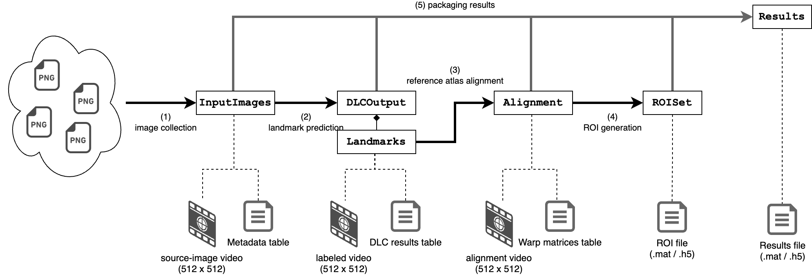

# `mesoscaler` Usage

1. [One-liner command](#1-one-liner-command)
2. [Step-by-step command-line processing](#2-step-by-step-command-line-processing)
3. [Python internals](#3-python-internals)
4. [Miscellaneous](#4-miscellaneous)




## 1. One-liner command

Installation of the `mesoscaler` package comes with the `mesoscaler` command-line interface that you can use in the following way:

```bash
# in your terminal emulator
mesoscaler process img1.png img2.png ...
```

This ends up processing all of the image files you pass as
`img1.png img2.png ...`, and results in a set of **results files**
`img1_mesoscaler.h5`, `img2_mesoscaler.h5`, and so on,
in the HDF5 format.

Each of the HDF files should contain the following data:

- **images** rescaled in 512 x 512 px size:
  - the original (source) image
  - the image labeled with landmarks being estimated by means of
    DeepLabCut
  - the landmark-labeled image, being overlaid with the landmarks
    of the reference atlas aligned on top of it
- **landmark estimation** information of 9 landmarks, predicted
  using DeepLabCut, containing their x-/y- coordinates and their likelihood information.

  Note that the coordinates are for the _rescaled_ images (whose sizes are 512 x 512 px).
- **reference alignment information**, in the form of warp matrices
  that convert points on the reference atlas (in 512 x 512) to
  those on the source image (rescaled to 512 x 512).
- **estimated ROI masks**, for the images in their original sizes.

> **NOTE**: by running `mesoscaler process --help` (or `-h` in short, in place of `--help`), you can find some more options you may find useful to tweak.


## 2. Step-by-step command-line processing

In case you want to scrutinize what is going on, you can perform the above one-liner step-by-step:

```bash
# 1. collect images into a single directory 'collected'
mesoscaler image-collection-step -o collected img1.png img2.png ...

# 2. estimate landmarks using the data in the 'collected' directory,
#    and put the results into the 'landmarks' directory
mesoscaler landmark-prediction-step -o landmarks collected

# 3. align the reference atlas to the images
#    using the data in the 'landmarks' directory,
#    and put the results into the 'alignment' directory
mesoscaler atlas-alignment-step -o alignment landmarks

# 4. generate ROI masks based on the alignment information
#    in the 'alignment' directory, referring to the original image sizes
#    from the information in the 'collected' directory.
#    the output files will be placed in the 'rois' directory.
mesoscaler roi-generation-step -M collected -o rois alignment

# 5. gather all the information so far, and pack it into a
#    single HDF file.
#    The resulting files will be in the 'results' directory.
mesoscaler packaging-step -L landmarks -A alignment -R rois -o results collected
```

> **NOTE**: similar to the `mesoscaler process` subcommand, you may find some useful options by calling `mesoscaler <subcommand> --help`.

## 3. Python internals

Several Python classes help running each of the [above steps](#2-step-by-step-command-line-processing)
(also refer to the image [above](#mesoscaler-usage)):

1. The collected images will be resized, and together form
   an `InputImages` object.
   This object should contain information such as
   original image sizes. It also manages saving to / loading from a directory.
2. Prediction of landmarks using DeepLabCut will result in
   a `DLCOutput` object.
   - The `DLCOutput` object has the data corresponding to the landmark-annotated
     video, and the table containing the inference results.
     This object also manages saving to / loading from a directory.
   - A `Landmarks` object will be created based on a `DLCOutput` object.
     This type of object will be used to alignment between the
     source data and the reference atlas.
   - Unless explicitly doing so, the reported coordinates will be
     based on the 'resized' 512 x 512 px format.
3. Alignment is done using the `Landmarks` objects from the data
   and from the reference atlas, and results in an `Alignment` object.
   This object is merely a warp matrix (or maybe a pair of them)
   describing the Affine transformation from the reference to data.

   Again, unless you resize the `Landmarks` explicitly, the
   reported transformation will be for the 512 x 512 px reference
   to the 512 x 512 px data images.

   **NOTE**: although the original MesoNet implementation primarily
   aligns the left and the right hemispheres separately,
   implementation of `mesoscaler` mainly uses alignment of
   both the hemispheres at once (based on a certain design decision).
   The use of 'separate' alignment can cause unexpected errors
   in the middle of the pipeline.

4. A `ROISet` object will be created based on the `Alignment` information
  (normally for the original, prior-to-resizing size images).
5. Finally, a `Results` object will be used to gather images,
   `Landmarks`, `Alignment` and `ROISet` objects for each source image.
   This object manages the storage to a `.mat` or to a `.h5` file.

## 4. Miscellaneous

- At the time of writing this, `mesoscaler` does not generate information about the borders of the ROIs. 
  You will need a way by using such as `scipy.ndimage.find_objects` (in Python)
  and `boundarymask` or `bwtraceboundary` (MATLAB Image-Processing Toolbox)